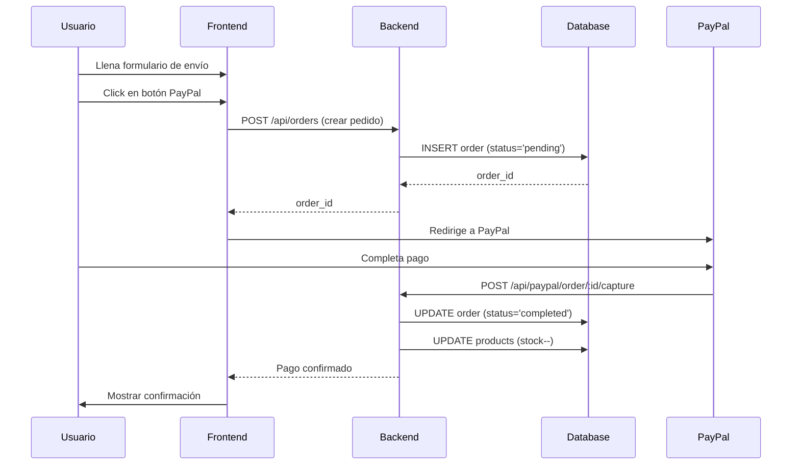

# 🎯 Guía Completa: Integración Frontend + Backend + Base de Datos

## ✅ ¿Qué se ha implementado?

Sistema completo de gestión de productos y pedidos con:
- ✅ **Base de datos SQLite** (productos, pedidos, sincronización)
- ✅ **API REST completa** (CRUD de productos y pedidos)
- ✅ **Sincronización con Mercagarage** (precios e inventario en tiempo real)
- ✅ **React Hooks** para consumir la API
- ✅ **Actualización automática de stock** al comprar
- ✅ **Integración con PayPal** con registro de pedidos

---

## 📂 Estructura de Archivos

```
server/
├── index.js          ← API REST actualizada con todos los endpoints
├── database.js       ← Gestión de base de datos SQLite
├── leggox.db         ← Base de datos (se crea automáticamente)
└── package.json

src/
├── hooks/
│   ├── useProducts.js              ← Hook para productos dinámicos
│   └── useMercagarageProducts.js   ← Hook para sincronización Mercagarage
├── Components/
│   ├── DynamicProductList.jsx      ← Componente de ejemplo con productos dinámicos
│   ├── PayPalCheckout.jsx          ← Actualizado para crear pedidos en BD
│   └── CheckoutFormPayPal.jsx      ← Actualizado con integración de BD
```

---

## 🚀 Paso a Paso: Cómo Usar

### 1. Iniciar el Servidor

```bash
cd server
node index.js
```

Verás:
```
✅ Base de datos inicializada
Payments API running on :4000
```

### 2. Sincronizar Productos de Mercagarage

**Opción A: Desde el frontend (recomendado)**

Usa el componente `DynamicProductList`:

```jsx
import DynamicProductList from './Components/DynamicProductList';

function App() {
  return <DynamicProductList />;
}
```

Haz clic en "🔄 Sincronizar con Mercagarage" para poblar la base de datos.

**Opción B: Desde la API directamente**

```bash
curl -X POST http://localhost:4000/api/products/sync \
  -H "Content-Type: application/json" \
  -d '{
    "productIds": ["1788", "28405", "60858", "87803", "87804"]
  }'
```

### 3. Consumir Productos Dinámicamente

#### Opción A: Hook `useProducts`

```jsx
import { useProducts } from './hooks/useProducts';

function ProductList() {
  const { products, loading, error } = useProducts({
    search: '',
    category: '',
    inStock: true,
  });

  if (loading) return <p>Cargando...</p>;
  if (error) return <p>Error: {error}</p>;

  return (
    <div>
      {products.map(product => (
        <div key={product.id}>
          <h3>{product.title}</h3>
          <p>€{product.price}</p>
          <p>Stock: {product.stock}</p>
        </div>
      ))}
    </div>
  );
}
```

#### Opción B: Fetch directo

```javascript
const response = await fetch('http://localhost:4000/api/products');
const products = await response.json();
```

### 4. Crear un Pedido con PayPal

El flujo es automático cuando usas `CheckoutFormPayPal`:

1. Usuario llena el formulario de envío
2. Hace clic en PayPal
3. **Se crea un pedido en la BD** (status: 'pending')
4. Usuario paga en PayPal
5. **Se actualiza el pedido a 'completed'**
6. **Se reduce el stock** de los productos

```jsx
import CheckoutFormPayPal from './Components/CheckoutFormPayPal';

function Checkout({ product }) {
  return (
    <CheckoutFormPayPal
      product={product}
      colors={{ red: '#DC2626', gray: '#6B7280', black: '#111827' }}
      onPaid={(details, shipping) => {
        console.log('Pago completado:', details);
        console.log('Datos de envío:', shipping);
      }}
    />
  );
}
```

---

## 📊 Endpoints de la API

### Productos

| Método | Endpoint | Descripción |
|--------|----------|-------------|
| `GET` | `/api/products` | Obtener todos los productos |
| `GET` | `/api/products/:id` | Obtener un producto por ID |
| `POST` | `/api/products/sync` | Sincronizar con Mercagarage |

**Parámetros de búsqueda** (GET `/api/products`):
- `search` - Buscar por título, referencia o descripción
- `category` - Filtrar por categoría
- `brand` - Filtrar por marca
- `inStock` - Solo productos en stock (`true`/`false`)

**Ejemplo:**
```bash
GET /api/products?search=manguito&inStock=true&brand=SEAT
```

### Pedidos

| Método | Endpoint | Descripción |
|--------|----------|-------------|
| `GET` | `/api/orders` | Obtener todos los pedidos |
| `GET` | `/api/orders/:id` | Obtener un pedido por ID |
| `POST` | `/api/orders` | Crear un nuevo pedido |

### Estadísticas

| Método | Endpoint | Descripción |
|--------|----------|-------------|
| `GET` | `/api/stats` | Obtener estadísticas generales |

**Respuesta:**
```json
{
  "products": {
    "total": 24,
    "inStock": 20,
    "outOfStock": 4
  },
  "orders": {
    "total": 15,
    "completed": 12,
    "pending": 3
  },
  "revenue": {
    "total": 1245.50
  }
}
```

---

## 💾 Estructura de la Base de Datos

### Tabla `products`

```sql
- id (TEXT PRIMARY KEY)
- reference (TEXT)
- title (TEXT NOT NULL)
- subtitle (TEXT)
- description (TEXT)
- price (REAL)
- original_price (REAL)
- currency (TEXT DEFAULT 'EUR')
- has_discount (INTEGER 0/1)
- price_without_tax (REAL)
- stock (INTEGER)
- minimum_quantity (INTEGER)
- image_url (TEXT)
- category (TEXT)
- brand (TEXT)
- model (TEXT)
- mercagarage_synced (INTEGER 0/1)
- last_sync_at (TEXT)
- created_at (TEXT)
- updated_at (TEXT)
```

### Tabla `orders`

```sql
- id (INTEGER PRIMARY KEY AUTOINCREMENT)
- order_id (TEXT UNIQUE)
- paypal_order_id (TEXT)
- customer_name (TEXT)
- customer_email (TEXT)
- customer_phone (TEXT)
- shipping_address (TEXT JSON)
- total (REAL)
- currency (TEXT)
- status (TEXT: 'pending', 'completed', 'cancelled')
- payment_method (TEXT)
- payment_details (TEXT JSON)
- created_at (TEXT)
- completed_at (TEXT)
```

### Tabla `order_items`

```sql
- id (INTEGER PRIMARY KEY)
- order_id (INTEGER FK)
- product_id (TEXT FK)
- product_title (TEXT)
- quantity (INTEGER)
- unit_price (REAL)
- total (REAL)
```

---

## 🔄 Flujo de Compra Completo



---

## 🎨 Ejemplos de Uso

### 1. Reemplazar productos estáticos con dinámicos

**Antes (estático):**
```jsx
import { PRODUCTS_DATA } from '../data/products';

function ProductList() {
  return PRODUCTS_DATA.map(product => (
    <ProductCard product={product} />
  ));
}
```

**Después (dinámico):**
```jsx
import { useProducts } from '../hooks/useProducts';

function ProductList() {
  const { products, loading } = useProducts();

  if (loading) return <p>Cargando...</p>;

  return products.map(product => (
    <ProductCard product={product} />
  ));
}
```

### 2. Buscar productos

```jsx
import { useProducts } from '../hooks/useProducts';

function SearchableProductList() {
  const [search, setSearch] = React.useState('');

  const { products } = useProducts({ search });

  return (
    <>
      <input
        value={search}
        onChange={e => setSearch(e.target.value)}
        placeholder="Buscar productos..."
      />
      {products.map(p => <ProductCard product={p} />)}
    </>
  );
}
```

### 3. Mostrar solo productos en stock

```jsx
const { products } = useProducts({ inStock: true });
```

### 4. Sincronizar manualmente

```jsx
import { useProducts } from '../hooks/useProducts';

function AdminPanel() {
  const { syncProducts, syncing } = useProducts();

  const handleSync = async () => {
    const productIds = ["1788", "28405", "60858"];
    await syncProducts(productIds);
    alert('Sincronizado!');
  };

  return (
    <button onClick={handleSync} disabled={syncing}>
      {syncing ? 'Sincronizando...' : 'Sincronizar'}
    </button>
  );
}
```

### 5. Ver estadísticas

```jsx
import { useStats } from '../hooks/useProducts';

function Dashboard() {
  const { stats, loading } = useStats();

  if (loading) return <p>Cargando...</p>;

  return (
    <div>
      <h2>Estadísticas</h2>
      <p>Productos: {stats.products.total}</p>
      <p>En stock: {stats.products.inStock}</p>
      <p>Pedidos completados: {stats.orders.completed}</p>
      <p>Ingresos totales: €{stats.revenue.total}</p>
    </div>
  );
}
```

---

## 🔧 Administrar la Base de Datos

### Ver todos los productos

```bash
sqlite3 server/leggox.db "SELECT id, title, price, stock FROM products;"
```

### Ver todos los pedidos

```bash
sqlite3 server/leggox.db "SELECT order_id, customer_name, total, status FROM orders;"
```

### Actualizar stock manualmente

```bash
sqlite3 server/leggox.db "UPDATE products SET stock = 10 WHERE id = '87803';"
```

### Borrar todos los productos (CUIDADO)

```bash
sqlite3 server/leggox.db "DELETE FROM products;"
```

### Backup de la base de datos

```bash
cp server/leggox.db server/leggox-backup-$(date +%Y%m%d).db
```

---

## 🎯 Migración desde Datos Estáticos

### Importar PRODUCTS_DATA a la base de datos

Crea `server/import-products.js`:

```javascript
import { PRODUCTS_DATA } from '../src/data/products.js';
import { upsertProduct } from './database.js';

console.log(`Importando ${PRODUCTS_DATA.length} productos...`);

let imported = 0;
for (const product of PRODUCTS_DATA) {
  try {
    upsertProduct({
      id: product.id,
      reference: product.reference,
      title: product.title,
      subtitle: product.subtitle,
      description: product.description,
      price: product.price || product.priceEUR || 0,
      originalPrice: product.originalPrice,
      currency: 'EUR',
      hasDiscount: product.hasDiscount ? 1 : 0,
      stock: product.inStock ? 100 : 0,
      minimumQuantity: 1,
      imageUrl: product.imageSrc,
      category: product.type,
      brand: product.brand,
      model: product.model,
      mercagarageSynced: 0,
    });
    imported++;
  } catch (err) {
    console.error(`Error importando ${product.id}:`, err.message);
  }
}

console.log(`✅ Importados ${imported}/${PRODUCTS_DATA.length} productos`);
```

Ejecutar:
```bash
cd server
node import-products.js
```

---

## 📝 TODO: Próximos Pasos

- [ ] Panel de administración web
- [ ] Autenticación de admin
- [ ] Exportar pedidos a CSV/Excel
- [ ] Notificaciones por email al comprar
- [ ] Sincronización automática programada (cada hora)
- [ ] Histórico de cambios de precios
- [ ] Sistema de alertas de stock bajo

---

## 🐛 Troubleshooting

### "Cannot find module 'better-sqlite3'"
```bash
cd server
npm install better-sqlite3
```

### "SQLITE_BUSY: database is locked"
Cierra cualquier programa que esté accediendo a `leggox.db` (ej: DB Browser for SQLite)

### "Products array is empty"
1. Verifica que el servidor esté corriendo
2. Sincroniza productos con Mercagarage
3. O importa desde PRODUCTS_DATA

### Stock no se actualiza al comprar
Verifica que `orderId` se está pasando en la captura de PayPal. Revisa logs del servidor.

---

**¿Dudas?** Revisa los ejemplos en:
- `src/Components/DynamicProductList.jsx`
- `src/hooks/useProducts.js`
- `server/database.js`
